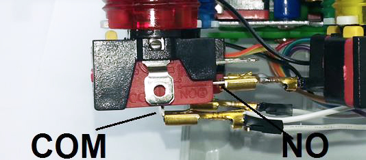
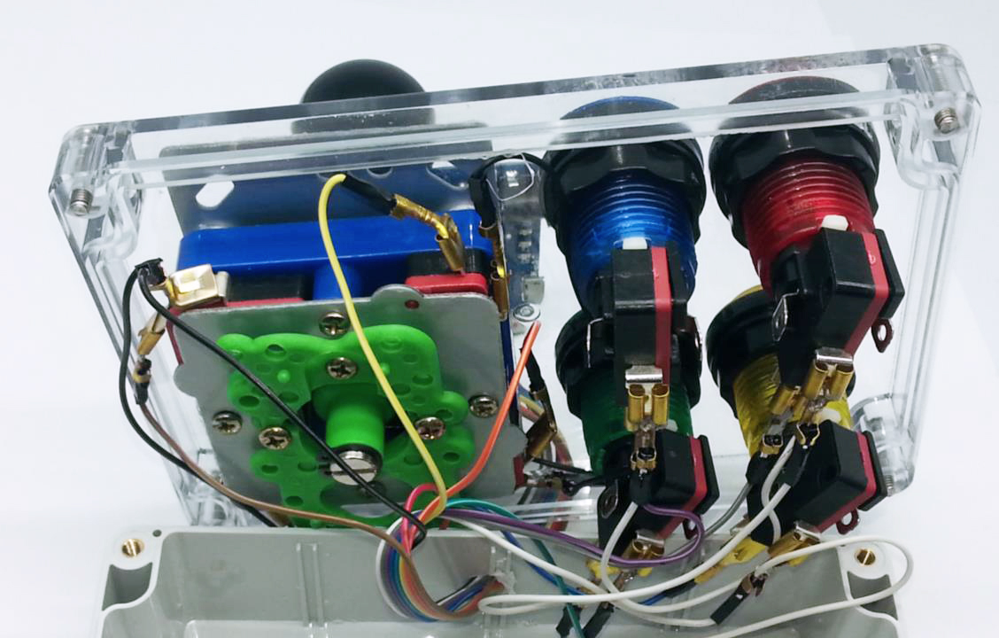

# Arcade Joystick
_Project 12_

There's a lot of arcade emulators out there that can run on many computers including the Raspberry Pi, so it only makes sense to play these emulators on some authentic hardware. Here we'll show you how to build an arcade style joystick using our new Arcade Pushbuttons and Arcade Joystick. We've got a Leonardo main board to emulate a USB keyboard, so it can be used with any software that you can play with a keyboard. Just like any other Arduino design, it can of course be customised to more buttons or even mapped to different keys. We've built ours in an ABS enclosure for portability, but there's no reason you couldn't mount the controls directly to an arcade cabinet or even a coffee table.

## Bill of Materials
| Qty | Code | Description |
| --- | --- | ---|
|1 | [XC4430](http://jaycar.com.au/p/XC4430) | Leonardo main board
|1 | [SM1052](http://jaycar.com.au/p/SM1052) | Arcade Joystick
|4 | [SP0662](http://jaycar.com.au/p/SP0662) | Arcade Buttons ( get a mix of colours)
|1 | [WC6024](http://jaycar.com.au/p/WC6024) | Plug-Plug jumpers
|2 | [PT4630](http://jaycar.com.au/p/PT4630) | spade connectors Pk10
|1 | [HB6248](http://jaycar.com.au/p/HB6248) | enclosure

## Connection Table
|Joystick|Leonardo|Wire Colour
| --- | --- | ---
|Grounds (COM)|GND|White and Black
|Joystick up|D2|Brown
|Joystick right|D3|Red
|Joystick down|D4|Orange
|Joystick left|D5|Yellow
|Green Button|D6|Green
|Yellow Button|D7|Blue
|Blue Button|D8|Purple
|Red Button|D9|Grey

## Downloads
* [Source code](..)

## Software Libraries
|Library | Author
| --- |---|
|N\A|N\A|

## Assembly
We built our joystick into a `HB6248` enclosure, which required drilling a number of 28mm holes for the buttons and the joystick shaft, as well as some smaller ones for the joystick mounting screws and for the cable to leave the enclosure. To mount the joystick, we unscrewed the top plate, and then clamped the lid of the box between the body and top plate of the joystick. Because there are so many ways of building this, we will focus on the electronics rather than hardware side of construction. It might pay to test the mechanical build before connecting the electronics, to make sure the wires are long enough and that you don't have to pull it apart after wiring it up.

The joystick has four microswitches, and each pushbutton has a single microswitch. For each microswitch, we want to connect the COM to GND, and then the N/O tabs are connected to an IO pin on the Leonardo to sense whether the microswitch has been triggered. For the joystick, these are the only two tabs, for the pushbuttons, they are the lower two tabs.

## Programming
Download the source code and extract into a new folder, open the .ino file in the Arduino IDE and press upload.

The sketch does not require any external libraries- the `Keyboard.h` library is included with recent versions of the IDE. The sketch will not work on boards like the Uno or Mega as they do not have USB support built into the main IC. Choose the Leonardo and its serial port and upload.

The sketch is very simple- the arrays at the start hold the digital pins and their corresponding keyboard keys. The number of pins and keys needs to match the `PINCOUNT` define value. After initialising, the Leonardo scans the pins, and if it detects a change, then it sends the corresponding key press or key release. A good guide to the keymappings and friendly names of some of the keys can be found on this page: https://www.arduino.cc/en/Reference/KeyboardModifiers

## Use
By default, the keys have been chosen to map to the defaults from the [MAME](http://mamedev.org/) emulator. The joystick is the same as the arrows keys, and the buttons are `left control`, `left alt`, `'1'` and `'5'` respectively. These buttons are mapped to the player one buttons, the player one start button, and player one coin (credit) button.

A good idea for testing the Joystick is to open up a Notepad window (under Windows), fill it with text, and see that the buttons react and seem to initiate the correct keystrokes. If you have an emulator installed, check that the joystick output corresponds to the keyboard output.

## Future Improvements

As noted above, the `PINCOUNT` value can be changed, and the Leonardo has 20 IO pins, plus another three on the ISP header so that if you need more buttons, extra pins can be allocated. We only stopped at four buttons because the enclosure wasn't big enough to fit more.

Alternatively, you could add a second joystick and some player two buttons, so that the joystick will work for two-player games. USB supports up to 127 devices per bus, so there is no reason a second unit cannot be built, but with the keys programmed to their player two equivalents, thus allowing two players to play at the same time.
